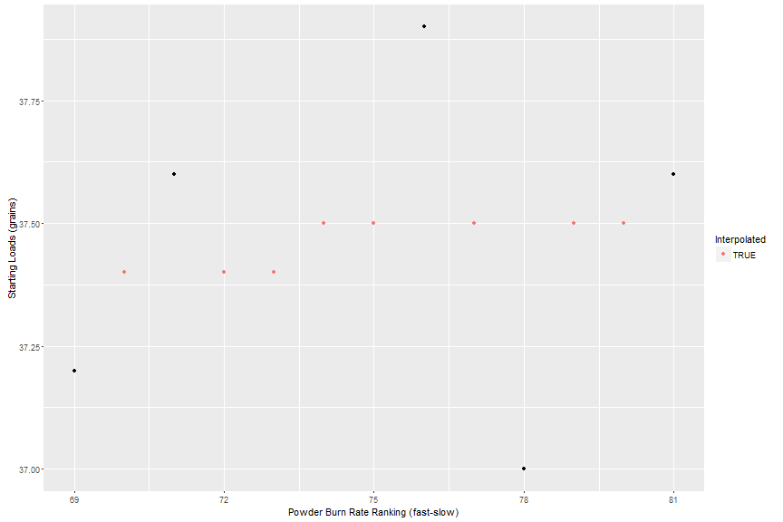

Powder Finder
PowderFinder: filling in the blanks in your load data
========================================================
author: dmendres
date: Fri Jan 22 10:07:12 2016


The Problem
========================================================

Hand-loading metallic cartridges for rifles and handguns is a popular hobby in the US and elsewhere.

The problem? Finding safe "recipes" to match the components at hand (powder type, primer, and bullets for a given cartridge).
- Load data requires extensive testing in pressure barrels
- The data is developed by component vendors, so they tend to cover one vendor's bullets or one brand of powders.
- Even the bullet manufacturers don't have the resources to test all appropriate powders.
- Collections only consolidate vendor-published data, with gaps.
- For example, the powder ranking table has 117 different powders, but our test data (albeit limited to a few cartridges) references a grand total of 24 powders!


The Solution
========================================================

[PowderFinder](https://dmendres.shinyapps.io/DataProductsProject) is a Shiny web-app which can suggest alternate powders and starting loads!

- Published tables rank and compare smokeless powders by burn rate, so similar burn rates are, within limits, interchangable, [for example, see the ADI equivalents table ](http://www.adi-powders.com.au/handloaders/equivalents.asp).
- PowderFinder uses the documented recipes and and smokless powder characteristics (burn rate, density and other predictors) to suggest alternate powders.
- PowderFinder builds regression models from these predictors to predict starting loads for the suggested powders.
- **DISCLAIMER all load information presented here and in the PowderFinder app is illustration of proof of concept and must not be used for actual cartridge loads. Check all loads against published sources!**


PowderFinder fills in the gaps
========================================================

- Published data has 5 loads for 155 grain bullet in a 308 Winchester cartridge:

```
    Manufacturer Product StartLoad
1        Hodgdon   H4895      37.2
3            IMR IMR4895      37.6
8            IMR IMR4064      37.9
10 Accurate Arms AAC2520      37.0
13       Hodgdon  Varget      37.6
```
- But PowderFinder finds 8 additional suggested loads

```
    Manufacturer   Product StartLoad
2     VihtaVuori      N530      37.4
4     VihtaVuori      N135      37.4
5        Alliant Reloder12      37.4
6            IMR   IMR4320      37.5
7  Accurate Arms    2495BR      37.5
9          Norma       202      37.5
11       Alliant Reloder15      37.5
12    VihtaVuori      N140      37.5
```

PowderFinder quality control
========================================================
PowderFinder plots the loads, highlighting interpolations 

